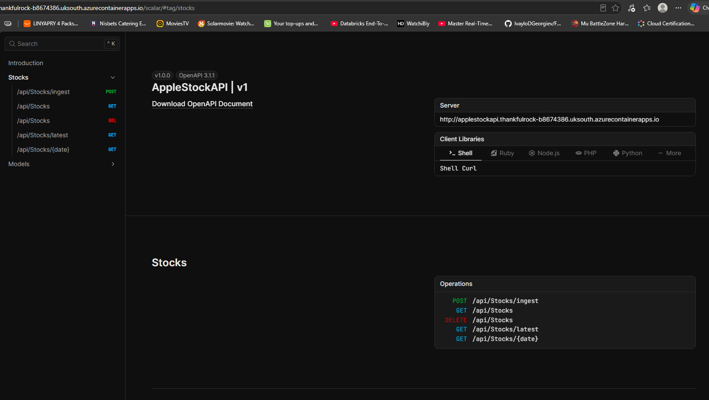

# Apple Stock API

A small ASP.NET Core Web API that ingests Apple (AAPL) daily price data from the free
[Alpha Vantage](https://www.alphavantage.co/) API, stores it in a relational database
via Entity Framework Core, and exposes it through both a documented HTTP API (Scalar)
and a lightweight HTML/CSS/JavaScript frontend.

This was built as the final-stage technical task for the Oakland Data Engineer role. The
brief asked for data ingestion, a storage schema, a display layer, a repeatable
deployment, and a GitHub repo with a clear README. Those five pieces are described below.

> **Naming note:** the task document used `OaklandStockData` as a placeholder solution
> name. This repository keeps the original scaffolded project name **`AppleStockAPI`**;
> the database it creates is called `AppleStockData`. Everything else follows the brief.

---

## Overview

The application does three things:

1. **Ingests** the last ~100 daily AAPL records from Alpha Vantage on demand.
2. **Stores** them in SQL Server (primary) or SQLite (portable alternative), de-duplicated
   by trading day.
3. **Serves** the stored data back through REST endpoints, a Scalar API reference for live
   testing, and a small "Apple Stock Explorer" web page with search, filtering, sorting and
   server-side pagination.

Only the ingest endpoint talks to Alpha Vantage. Every read endpoint (and therefore the
whole frontend) reads exclusively from the database.

---

## Architecture

```text
                 Alpha Vantage API
                        │  HTTP (IHttpClientFactory)
                        ▼
                 StockDataService          ← deserialize, validate, map, de-duplicate
                        │
                        ▼
                   EF Core (StockDbContext)
                        │
                        ▼
              SQL Server  ──or──  SQLite    ← selected by a single config value
                        │
                        ▼
                  StocksController          ← REST endpoints (JSON)
                    │            │
                    ▼            ▼
                 Scalar     wwwroot (HTML/CSS/JS)
              (API demo)     "Apple Stock Explorer"
```

The provider decision is the only thing that changes between SQL Server and SQLite. The
controller, service, entity, DTOs and Alpha Vantage client are all provider-agnostic.

---

## Technology

- **.NET 10** / **ASP.NET Core Web API** (controllers, not minimal APIs)
- **Entity Framework Core 10** (`SqlServer` and `Sqlite` providers)
- **SQL Server** — primary database, initialised with an EF Core migration
- **SQLite** — optional portable database, initialised with `EnsureCreated`
- **Alpha Vantage** `TIME_SERIES_DAILY` endpoint via `IHttpClientFactory` + `System.Text.Json`
- **Scalar** for OpenAPI documentation and live endpoint execution
- **Docker** (multi-stage build) for repeatable deployment
- **Vanilla HTML5 / CSS3 / JavaScript** frontend served from `wwwroot` (no framework)

---

## Project structure

```text
AppleStockAPI/
├── Controllers/
│   └── StocksController.cs          # ingest + read endpoints
├── Data/
│   └── StockDbContext.cs            # DbSet + unique index (Symbol, PriceDate)
├── Models/
│   └── StockPrice.cs               # the stored entity
├── DTOs/
│   ├── AlphaVantageResponse.cs      # maps Alpha Vantage JSON
│   ├── AlphaVantageDailyPrice.cs
│   ├── StockPriceDto.cs            # API output shape (no internal columns)
│   ├── PagedResult.cs
│   ├── IngestionResult.cs
│   └── StockQueryParameters.cs      # page/pageSize/search/fromDate/toDate/sort
├── Services/
│   ├── IStockDataService.cs
│   └── StockDataService.cs          # ingestion + database-side querying
├── Options/
│   ├── AlphaVantageOptions.cs
│   └── DatabaseOptions.cs
├── Migrations/                      # EF Core InitialCreate (SQL Server)
├── wwwroot/
│   ├── index.html
│   ├── css/site.css
│   └── js/stocks.js
├── Program.cs                       # DI, provider switch, DB init, Scalar, static files
├── appsettings.json                 # committed – placeholder API key
├── appsettings.Development.json     # NOT committed – holds the real API key
└── Dockerfile
```

---

## Getting started

### Prerequisites

- [.NET 10 SDK](https://dotnet.microsoft.com/download)
- A free Alpha Vantage API key: https://www.alphavantage.co/support/#api-key
- For the SQL Server path: any reachable SQL Server instance (LocalDB, Developer Edition,
  Express, or a container). SQLite needs nothing extra.

### 1. Add your Alpha Vantage API key

The committed `appsettings.json` ships with a placeholder:

```json
"AlphaVantage": {
  "BaseUrl": "https://www.alphavantage.co/query",
  "ApiKey": "YOUR_API_KEY_HERE"
}
```

**Never commit a real key.** Put your key in `appsettings.Development.json`, which is
listed in `.gitignore`:

```json
{
  "AlphaVantage": {
    "ApiKey": "your-real-key-here"
  }
}
```

Alternatives that also work: [.NET user-secrets](https://learn.microsoft.com/aspnet/core/security/app-secrets)
(`dotnet user-secrets set "AlphaVantage:ApiKey" "your-real-key"`) or the environment
variable `AlphaVantage__ApiKey`. If the key is missing or still the placeholder, the
ingest endpoint returns a clear error instead of calling the API.

### 2a. Run with SQL Server (primary)

Make sure `appsettings.json` has:

```json
"Database": { "Provider": "SqlServer" },
"ConnectionStrings": {
  "SqlServer": "Server=localhost;Database=AppleStockData;Trusted_Connection=True;TrustServerCertificate=True;"
}
```

Then:

```bash
dotnet restore
dotnet run
```

On startup the application applies the EF Core migration, which **creates the
`AppleStockData` database and the `StockPrices` table if they do not already exist**. No
manual SQL is required. (If your instance needs SQL authentication, swap
`Trusted_Connection=True` for `User Id=...;Password=...`.)

### 2b. Run with SQLite (portable, zero setup)

Change one value:

```json
"Database": { "Provider": "Sqlite" }
```

Then `dotnet run`. A `stockdata.db` file is created next to the app and the schema is
built automatically — no database server needed. This is the easiest way to try the
project on any machine.

### 3. Use it

When the app starts it prints its URLs. Open:

- **`/`** — the Apple Stock Explorer frontend
- **`/scalar`** — the Scalar API reference (run the endpoints live here)

A typical first run: open `/scalar`, `POST /api/stocks/ingest`, then `GET /api/stocks`.
Or just open `/` and click **Import AAPL Data** / **Refresh Stock Data**.

### 4. Run with Docker

```bash
docker build -t apple-stock-api .
docker run -p 8080:8080 -e AlphaVantage__ApiKey=your-real-key apple-stock-api
```

The image **defaults to SQLite** so the container is self-contained. Open
`http://localhost:8080/`. To point the container at SQL Server instead, override the
provider and connection string:

```bash
docker run -p 8080:8080 \
  -e AlphaVantage__ApiKey=your-real-key \
  -e Database__Provider=SqlServer \
  -e "ConnectionStrings__SqlServer=Server=host.docker.internal;Database=AppleStockData;User Id=sa;Password=Your_password123;TrustServerCertificate=True;" \
  apple-stock-api
```

---

## API endpoints

| Method & route | Purpose |
| --- | --- |
| `POST /api/stocks/ingest` | Fetch the latest AAPL data from Alpha Vantage (the free *compact* feed — last 100 days) and store any new days. Idempotent — existing days are skipped. Returns an ingestion summary. |
| `GET /api/stocks` | Return stored records as a paged result. Supports `page`, `pageSize` (max 100), `search`, `fromDate`, `toDate`, `sortBy` (`priceDate`/`close`/`volume`), `sortDirection` (`asc`/`desc`). Never calls Alpha Vantage. |
| `GET /api/stocks/latest` | Return the newest stored record, or `404` if the store is empty. |
| `GET /api/stocks/{date}` | Optional. Return the record for a specific `yyyy-MM-dd`, or `404`. |
| `DELETE /api/stocks` | Delete every stored record (handy for resetting the SQLite demo database). Returns `{ "deleted": n }`. |

Example ingest response (second run, everything already stored):

```json
{ "symbol": "AAPL", "recordsReceived": 100, "recordsInserted": 0, "recordsSkipped": 100 }
```

Example `GET /api/stocks?page=1&pageSize=20`:

```json
{
  "items": [
    { "symbol": "AAPL", "priceDate": "2026-08-18", "open": 229.80, "high": 232.44,
      "low": 228.92, "close": 231.59, "volume": 48239201, "source": "Alpha Vantage" }
  ],
  "page": 1, "pageSize": 20, "totalCount": 100, "totalPages": 5
}
```

---

## Using Scalar (live API testing)

The API ships with **[Scalar](https://scalar.com/)**, an interactive API reference generated
from the app's OpenAPI document. It lets you read and **run every endpoint live** from the
browser — no Postman or curl needed — which makes it the quickest way to exercise the API
during a demo or review.

Open it at **`/scalar`** — locally `http://localhost:8080/scalar`, or on the deployed app
`https://<app>.<region>.azurecontainerapps.io/scalar`:



**How to use it:**

1. The left sidebar lists the endpoints grouped under **Stocks** — click one (e.g.
   `POST /api/Stocks/ingest`).
2. Click **Test Request** (top-right of the endpoint) to open the interactive panel.
3. Fill in any inputs: query parameters like `page` / `pageSize` for `GET /api/stocks`, or the
   `{date}` path value for `GET /api/stocks/{date}`. Endpoints with no inputs (ingest, latest,
   delete) need nothing.
4. Click **Send** — Scalar calls the live API and shows the real HTTP status and JSON response.
5. The **Server** box at the top is the address requests go to; opening Scalar on the deployed
   app automatically targets that Azure URL (as shown above).

A good end-to-end run: `POST /api/stocks/ingest` (loads data) → `GET /api/stocks` (see it
paged) → `GET /api/stocks/latest` → `POST /api/stocks/ingest` again (watch `recordsInserted`
drop to `0` as duplicates are skipped) → `DELETE /api/stocks` (wipe) → `GET /api/stocks` (empty).

---

## Frontend

`wwwroot` contains a single-page "Apple Stock Explorer" built with plain HTML, CSS and
JavaScript, served through ASP.NET Core static files (`app.UseDefaultFiles()` +
`app.UseStaticFiles()`), so it loads at `/`. It shows the latest close in a summary card
and the full history in a table with a debounced search box, from/to date filters, five
sort options, and pagination controls. Each row also shows a coloured **Change** (close vs
open, green ▲ / red ▼) and a **Day range** bar (where the open-to-close move sat within the
day's low–high); column headings and the range bars have explanatory tooltips. An **Ingest
Data** button in the header triggers a fresh pull from Alpha Vantage, and a **Clear Data**
button (with a confirmation dialog) empties the database — useful for resetting the SQLite
demo.

Crucially, **the browser only ever calls this application's own API** — it never contacts
Alpha Vantage directly, and it never receives the API key. Search, filtering, sorting and
paging are all performed in the database (see below), not in the browser; the page
requests one page of 20 records at a time.

---

## Database schema and why it was chosen

The single table is `StockPrices`, mapped from the `StockPrice` entity:

| Column | Type | Reason |
| --- | --- | --- |
| `Id` | int, identity, PK | Internal surrogate key — stable and independent of business data. |
| `Symbol` | nvarchar(16) | The ticker (`AAPL`). Storing it explicitly lets the same table hold other symbols later without a schema change. |
| `PriceDate` | datetime2 | The trading day the record represents. |
| `Open` / `High` / `Low` / `Close` | decimal(18,4) | Prices. `decimal` (not `double`) avoids floating-point rounding; `(18,4)` keeps four dp precision. |
| `Volume` | bigint | Share volume easily exceeds `int` range, so `long`/`bigint`. |
| `Source` | nvarchar(64) | Provenance of the row (`Alpha Vantage`). Useful if more data sources are added. |
| `IngestedAtUtc` | datetime2 | When *our system* imported the row — deliberately separate from `PriceDate` (when the data is *about*). |

**Unique index on `(Symbol, PriceDate)`.** A given symbol can have only one row per
trading day. This is enforced by the database, which makes ingestion **idempotent**: you
can run `POST /api/stocks/ingest` as many times as you like and existing days are skipped
rather than duplicated. The service also checks existing days in code so a normal re-run
never even attempts a duplicate insert; the unique index is the safety net.

The design is deliberately a single, well-indexed table. The data is naturally flat
(one row per symbol per day), so a normalised multi-table model would add joins and
complexity with no benefit at this scale.

### Why SQL Server as the primary database

- It is a realistic, production-style relational database.
- It demonstrates EF Core connectivity, automatic database/table creation, and relational
  schema design end to end.
- It reflects existing hands-on SQL Server experience.

### Why SQLite is also supported

- It needs no external server, so the project runs on any machine with just the .NET SDK.
- It is convenient for demos, quick trials, and the Docker image.

The Oakland brief allows any suitable database (it lists SQLite, Postgres, "anything
suitable"); SQL Server is this implementation's choice, with SQLite as a portable fallback.
SQL Server uses a proper EF Core migration (`InitialCreate`) applied at startup via
`Database.MigrateAsync()`. SQLite uses `EnsureCreated()` so the portable path never depends
on SQL Server-specific migration SQL — the brief explicitly notes SQLite support must not
jeopardise the primary SQL Server path.

---

## What works

- Fetches AAPL daily data from Alpha Vantage using a configured, typed `HttpClient`.
- Deserializes the Alpha Vantage JSON and maps it into a strongly typed `StockPrice`.
- Persists records with EF Core to SQL Server or SQLite (selected by config).
- Prevents duplicate daily records via a unique index plus an in-code existence check.
- Automatically creates the database/schema on startup (migration for SQL Server,
  `EnsureCreated` for SQLite).
- Retrieves stored data through `GET /api/stocks` (paged, searchable, filterable, sortable),
  `GET /api/stocks/latest`, and `GET /api/stocks/{date}`.
- Server-side pagination, filtering and sorting — the browser never downloads the whole table.
- Live API testing through Scalar at `/scalar`.
- Apple-inspired responsive frontend at `/` with loading, empty and error states.
- Repeatable deployment via a multi-stage Dockerfile.
- Meaningful errors for missing/placeholder API key, Alpha Vantage error/rate-limit
  responses, and empty responses; the API key is never logged or returned.

## What does not work / limitations

- **AAPL only.** The ingest endpoint is hard-coded to Apple, although the schema and query
  layer already support arbitrary symbols.
- **Manual ingestion.** New data arrives only when `POST /api/stocks/ingest` is called;
  there is no scheduler yet.
- **Alpha Vantage free tier limits.** The free key is rate-limited (a small number of
  requests per day); the app detects and surfaces the limit message but cannot bypass it.
- **Last 100 days only.** The app uses Alpha Vantage's free *compact* daily feed (latest 100
  days). Full history (`outputsize=full`, ~20 years) is a paid Alpha Vantage feature, so it is
  intentionally not used.
- **No authentication.** All endpoints are open.
- **SQLite decimal ordering.** SQLite has no native `decimal` type; sorting large price sets
  by `Close` on SQLite can differ slightly from SQL Server. SQL Server (the primary path)
  is unaffected.
- **No automated test suite** in this iteration (see improvements).

## Improvements with more time

- **Scheduled ingestion** via a `BackgroundService` (or Hangfire / an Azure Function timer)
  to replace the manual trigger.
- **Multiple symbols**, e.g. `POST /api/stocks/{symbol}/ingest`.
- **Automated tests** — unit tests for mapping/de-duplication, integration tests against a
  SQLite in-memory database, and API tests for the endpoints.
- **Resilience** — Polly retries, exponential backoff, a circuit breaker, and richer
  rate-limit handling around the Alpha Vantage call.
- **Secrets & hosting** — Azure Key Vault for the API key and Azure SQL for a managed
  database in production.
- **Observability** — structured logging, health checks, and metrics.
- **CI/CD** — a GitHub Actions pipeline (restore → build → test → docker build). The brief
  notes CI/CD is a bonus, not a requirement.

---

## Design notes for the walkthrough

- The task only required a basic display layer, so the API itself satisfies it. The HTML
  frontend is an extra, deliberately framework-free, to show how a consumer would use the
  stored data.
- Pagination, search and filtering run in the database (EF Core `Where`/`OrderBy`/`Skip`/
  `Take` before `ToListAsync`), so the app doesn't load the whole table into memory. The
  dataset is small here, but the retrieval pattern stays appropriate as it grows.
- A single `Database:Provider` setting chooses the EF Core provider; nothing else in the
  codebase changes when switching between SQL Server and SQLite.

---

## Deployment — CI/CD to Azure Container Apps

The app runs as a Docker container on **Azure Container Apps** (free Consumption plan), and
every push to `main` automatically rebuilds and redeploys it via **GitHub Actions**. The two
sections below document the setup exactly, so it can be recreated from scratch.

**Flow:** `git push` → GitHub Actions builds the image → pushes it to GitHub Container Registry
(`ghcr.io`) → logs in to Azure with OIDC (no password) → tells the Container App to run the new
image.

> **Order matters:** do **Azure Container Setup** first (it creates the infrastructure and the
> deployment identity), then **GitHub Pipeline Setup** (the workflow that deploys into it).

### What's in the resource group

Everything lives in one resource group (`AppleWebAPI`). After setup it contains three resources:

| Resource | Type | What it's for |
| --- | --- | --- |
| `applestock-env` | Container Apps Environment | The hosting boundary every container app runs inside — it defines the shared network and logging context for the app. Free on the Consumption plan. |
| `applestockapi` | Container App | The running application itself. It pulls the image from `ghcr.io`, exposes public HTTPS ingress on port 8080, holds the Alpha Vantage key as a secret, and **scales to zero** when idle (which is what keeps it free). |
| `workspace-xxxxxxxx` | Log Analytics workspace | Auto-created alongside the environment. It collects the container's console/log output so you can view and query logs in the portal. |

---

## Azure Container Setup

Run these once in **Azure Cloud Shell** (the `>_` icon in the portal, set to **Bash**). Replace
the placeholder values in step 0 with your own.

<details>
<summary><b>Step 0 — Set session variables</b></summary>

```bash
RG=AppleWebAPI
LOCATION=uksouth                      # UK West doesn't offer Container Apps; the RG's region is just a label
ENVIRONMENT=applestock-env
APP=applestockapi
IMAGE=ghcr.io/ivaylodgeorgiev/applestockapi   # must be lowercase
GH_REPO=IvayloDGeorgiev/AppleStockAPI

SUBSCRIPTION_ID=$(az account show --query id -o tsv)
TENANT_ID=$(az account show --query tenantId -o tsv)
echo "Subscription: $SUBSCRIPTION_ID"
echo "Tenant:       $TENANT_ID"
```

_📸 Screenshot placeholder: `docs/images/az-00-variables.png`_
</details>

<details>
<summary><b>Step 1 — Register the Container Apps provider + CLI extension</b></summary>

```bash
az extension add --name containerapp --upgrade
az provider register --namespace Microsoft.App
az provider register --namespace Microsoft.OperationalInsights
```

The two `register` commands run in the background. Wait until both report `Registered`:

```bash
az provider show -n Microsoft.App --query registrationState -o tsv
az provider show -n Microsoft.OperationalInsights --query registrationState -o tsv
```

_📸 Screenshot placeholder: `docs/images/az-01-providers-registered.png`_
</details>

<details>
<summary><b>Step 2 — Create the Container Apps environment</b></summary>

```bash
az containerapp env create \
  --name "$ENVIRONMENT" \
  --resource-group "$RG" \
  --location "$LOCATION"
```

Takes ~2–3 minutes and auto-creates the Log Analytics workspace. Success = JSON with
`"provisioningState": "Succeeded"`.

_📸 Screenshot placeholder: `docs/images/az-02-environment.png`_
</details>

<details>
<summary><b>Step 3 — Create the Container App</b></summary>

Created with a temporary placeholder image; the pipeline swaps in the real image on its first
run. Key settings: port 8080, external HTTPS ingress, the Alpha Vantage key as a **secret**,
SQLite, and scale-to-zero.

```bash
az containerapp create \
  --name "$APP" \
  --resource-group "$RG" \
  --environment "$ENVIRONMENT" \
  --image mcr.microsoft.com/k8se/quickstart:latest \
  --target-port 8080 \
  --ingress external \
  --min-replicas 0 \
  --max-replicas 1 \
  --cpu 0.25 --memory 0.5Gi \
  --secrets alpha-vantage-key=YOUR_ALPHA_VANTAGE_KEY \
  --env-vars AlphaVantage__ApiKey=secretref:alpha-vantage-key Database__Provider=Sqlite
```

The placeholder image serves on port 80, so this first revision shows **unhealthy** — expected;
the first pipeline deploy fixes it. Get the public URL with:

```bash
az containerapp show -n "$APP" -g "$RG" --query properties.configuration.ingress.fqdn -o tsv
```

_📸 Screenshot placeholder: `docs/images/az-03-container-app.png`_
</details>

<details>
<summary><b>Step 4 — Create the passwordless deploy identity (OIDC)</b></summary>

GitHub Actions logs in to Azure with **no stored password** — it uses a Microsoft Entra app
registration whose trust is federated to this repo.

```bash
# 4a. App registration + service principal
APP_ID=$(az ad app create --display-name "gh-applestockapi-deploy" --query appId -o tsv)
az ad sp create --id "$APP_ID"
echo "APP_ID=$APP_ID"

# 4b. Federated credential (trust GitHub Actions on this repo's main branch)
az ad app federated-credential create \
  --id "$APP_ID" \
  --parameters "{
    \"name\": \"github-main\",
    \"issuer\": \"https://token.actions.githubusercontent.com\",
    \"subject\": \"repo:${GH_REPO}:ref:refs/heads/main\",
    \"audiences\": [\"api://AzureADTokenExchange\"]
  }"

# 4c. Grant Contributor on the resource group only (least privilege)
az role assignment create \
  --assignee "$APP_ID" \
  --role Contributor \
  --scope "/subscriptions/${SUBSCRIPTION_ID}/resourceGroups/${RG}"

# 4d. Print the three values needed as GitHub secrets
echo "AZURE_CLIENT_ID=$APP_ID"
echo "AZURE_TENANT_ID=$TENANT_ID"
echo "AZURE_SUBSCRIPTION_ID=$SUBSCRIPTION_ID"
```

> **Gotcha — `AADSTS700213` (immutable subject).** GitHub may present a subject that includes
> numeric IDs, e.g. `repo:OWNER@12345/REPO@67890:ref:refs/heads/main`, which won't match the
> name-based subject in 4b. If the pipeline's **Log in to Azure** step fails with `AADSTS700213`,
> copy the exact `subject` string from that error and add a second matching credential:
>
> ```bash
> SUBJECT='<paste the exact subject from the error>'
> az ad app federated-credential create \
>   --id "$APP_ID" \
>   --parameters "{\"name\":\"github-main-immutable\",\"issuer\":\"https://token.actions.githubusercontent.com\",\"subject\":\"$SUBJECT\",\"audiences\":[\"api://AzureADTokenExchange\"]}"
> ```

_📸 Screenshot placeholder: `docs/images/az-04-oidc-identity.png`_
</details>

---

## GitHub Pipeline Setup

<details>
<summary><b>Step 1 — Add the three repository secrets</b></summary>

In the repo: **Settings → Secrets and variables → Actions → New repository secret**. Add the
three values printed in Azure Step 4d (these are identifiers, not passwords — the real trust is
the federated credential):

| Name | Value |
| --- | --- |
| `AZURE_CLIENT_ID` | the app registration's `appId` |
| `AZURE_TENANT_ID` | your tenant ID |
| `AZURE_SUBSCRIPTION_ID` | your subscription ID |

_📸 Screenshot placeholder: `docs/images/gh-01-secrets.png`_
</details>

<details>
<summary><b>Step 2 — Add the workflow file</b></summary>

Create `.github/workflows/deploy.yml` with the content below and commit it to `main`. It has two
jobs — **build** (build & push the image to ghcr) and **deploy** (`needs: build`, OIDC login,
then update the Container App):

```yaml
name: Build and deploy to Azure Container Apps

on:
  push:
    branches: [ main ]
  workflow_dispatch:

env:
  IMAGE: ghcr.io/ivaylodgeorgiev/applestockapi   # must be lowercase
  RESOURCE_GROUP: AppleWebAPI
  APP_NAME: applestockapi

jobs:
  build:
    name: Build and push image
    runs-on: ubuntu-latest
    permissions:
      contents: read
      packages: write
    steps:
      - name: Checkout
        uses: actions/checkout@v4

      - name: Log in to GitHub Container Registry
        uses: docker/login-action@v3
        with:
          registry: ghcr.io
          username: ${{ github.actor }}
          password: ${{ secrets.GITHUB_TOKEN }}

      - name: Build and push image
        uses: docker/build-push-action@v6
        with:
          context: .
          push: true
          tags: |
            ${{ env.IMAGE }}:latest
            ${{ env.IMAGE }}:${{ github.sha }}

  deploy:
    name: Deploy to Container App
    needs: build
    runs-on: ubuntu-latest
    permissions:
      contents: read
      id-token: write
    steps:
      - name: Log in to Azure (OIDC, no password)
        uses: azure/login@v2
        with:
          client-id: ${{ secrets.AZURE_CLIENT_ID }}
          tenant-id: ${{ secrets.AZURE_TENANT_ID }}
          subscription-id: ${{ secrets.AZURE_SUBSCRIPTION_ID }}

      - name: Deploy new image to Container App
        uses: azure/cli@v2
        with:
          azcliversion: latest
          inlineScript: |
            az config set extension.use_dynamic_install=yes_without_prompt
            az containerapp update \
              --name "$APP_NAME" \
              --resource-group "$RESOURCE_GROUP" \
              --image "${IMAGE}:${GITHUB_SHA}"
```

_📸 Screenshot placeholder: `docs/images/gh-02-workflow-run.png`_
</details>

<details>
<summary><b>Step 3 — Make the image package public</b></summary>

The first pipeline run creates the image on `ghcr.io`, initially **private**, so the Container
App can't pull it yet. Make it public once: GitHub → your profile **Packages** → open
**applestockapi** → **Package settings** → **Change visibility → Public**.

_(Alternative for a private image: give the Container App pull credentials with*
`az containerapp registry set --server ghcr.io --username <user> --password <PAT-with-read:packages> -n applestockapi -g AppleWebAPI`.)_

_📸 Screenshot placeholder: `docs/images/gh-03-package-public.png`_
</details>

<details>
<summary><b>Step 4 — Verify</b></summary>

1. Under the repo's **Actions** tab, the run should show **Build ✅ → Deploy ✅**.
2. Open the Container App URL (Azure Step 3). Allow a few seconds for the scale-to-zero cold
   start, then click **Ingest Data** to confirm live data flows in the cloud.
3. From now on, every push to `main` rebuilds and redeploys automatically.

> **Note on data:** because the app scales to zero and uses SQLite inside the container, the
> database is empty after each cold start or new deploy — click **Ingest Data** to refill it.
> Azure SQL would be the persistent production alternative.

_📸 Screenshot placeholder: `docs/images/gh-04-verify.png`_
</details>
